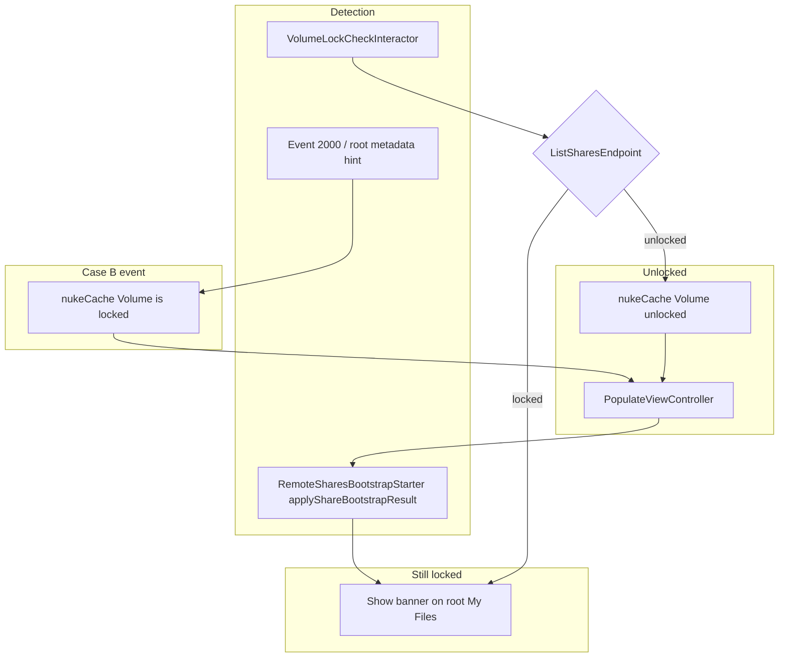

# Volume lock (iOS)

Lightweight iOS handler for when a user's Drive volume is locked server-side. macOS uses `VolumeLockLifecycleController` in `ProtonDrive-macOS`; this module is iOS-only and does not share that reconcile loop.

Bootstrap in this doc means the `DriveBootstrapStarter` chain run from `PopulateViewController`.

## User-facing behavior

A hint banner appears at the top of **root My Files** when the volume is locked.

| Element | Behavior |
|---|---|
| Message | "Restore access to your locked files" |
| **Details** | Opens `SFSafariViewController` at `drive.{baseOrigin}` so user can recovery from web |
| **Check** | Re-fetches shares via `ListSharesEndpoint` (`showAll: .disabled`); if unlocked, clears cache and re-populates |
| Dismiss (X) | Hides banner for the session (`isBannerDismissed` is in-memory; lost on app kill) |
| Foreground | Silent Check (no banner re-show if dismissed) |
| Safari closed | Silent Check |
| My Files open | If still locked, dismissed banner is shown again |

The banner stacks with the account storage/subscription `LockedStateTopBannerView`; it does not replace it.

## Lock detection

Lock state for the banner is set from **`RemoteSharesBootstrapStarter`** after each successful remote shares bootstrap. It uses the same `ListSharesEndpoint` fetch (`showAll: .disabled`) and `VolumeLockShareStrategy` rules as Check / event handling.

A share is treated as locked when:

- `locked == true`, or
- `state == .locked`

Unlocked (for **Check** / foreground) means an active, non-locked **main** share exists.

`VolumeLockController.applyShareBootstrapResult(lockedShares:)`:

- Sets `isVolumeLocked` from whether `lockedShares` is non-empty
- Clears `isBannerDismissed` when still locked

`VolumeLockController.finishPopulate()` (called when `DriveBootstrapStarter` completes or fails):

- Resets `isNukingCache` (allows a future Case B event to nuke again after populate)

## Cases

Three situations differ by **when the lock happened** and **what is on disk**. Case B is defined by pre-lock cached data, not by whether the app was running at lock time.

### Case A — Login after volume is locked

**Situation:** User logs in (or fresh install) after the volume was already locked. No stale pre-lock cache.

**How we handle it:**

1. `RemoteSharesBootstrapStarter` fetches shares and bootstraps the new active main share.
2. `applyShareBootstrapResult(lockedShares:)` → banner on root My Files.

### Case B — Client had data before lock

**Situation:** User was using the app (or has pre-lock cache on disk). Volume is locked while logged in. Lock is learned once online via events.

**How we handle it:**

1. `DriveEventsLoop` code **2000** or root metadata change → `VolumeLockEventsListener`.
2. `handleVolumeLockHint()` confirms via API, then `nukeCache("Volume is locked")` → `PopulateViewController` + full bootstrap.
3. Remote shares bootstrap → `applyShareBootstrapResult(lockedShares:)` → banner on root My Files.

In-flight transfers fail with **2501**; no special handling beyond cache wipe.

### Case C — Stale cache after web recovery

**Situation:** User had pre-lock cache; web recovery created **new** volumes; client still held old share metadata.

**How we handle it:**

1. Always-remote address + shares bootstrap replaces stale data (bootstraps the new active main share).
2. `applyShareBootstrapResult(lockedShares:)` → empty My Files + banner.
3. After web recovery, bootstrap with no `lockedShares` → `applyShareBootstrapResult` clears `isVolumeLocked` (or **Check** / foreground triggers `nukeCache("Volume unlocked")` + populate).

Web recovery while the app stays open: uploads can work without relaunch; Check/foreground still updates banner state.

## Recovery flows



| Trigger | Action when locked | Action when unlocked |
|---|---|---|
| Remote shares bootstrap | `applyShareBootstrapResult` → show banner if `lockedShares` non-empty | `applyShareBootstrapResult` → clear banner |
| Event 2000 / metadata hint | `nukeCache` + populate → bootstrap | — |
| User taps **Check** | Keep/show banner | `nukeCache` + populate |
| Foreground | Silent Check (no dismiss override) | `nukeCache` + populate |
| Safari dismiss (`VolumeLockCoordinator`) | Silent Check (no dismiss override) | `nukeCache` + populate |

## Module layout

```
VolumeLock/
├── Application/VolumeLockController.swift
├── Coordinator/VolumeLockCoordinator.swift
├── Domain/
│   ├── VolumeLockShareStrategy.swift
│   ├── VolumeLockCheckInteractor.swift
│   └── VolumeLockRecoveryInteractor.swift
├── Resource/
│   ├── NukeCacheResource.swift
│   └── VolumeLockEventsListener.swift
├── Presentation/VolumeLockBannerViewModel.swift
├── View/VolumeLockBannerView.swift
└── Injection/
    └── VolumeLockFactory.swift
```

| File | Role |
|---|---|
| `Application/VolumeLockController` | `@MainActor` state, Check, nuke orchestration via `NukeCacheResource`, `applyShareBootstrapResult`, `finishPopulate` |
| `Coordinator/VolumeLockCoordinator` | Safari recovery navigation (Details); no UIKit in controller |
| `Domain/VolumeLockShareStrategy` | Shared locked/unlocked rules for controller and bootstrap |
| `Resource/NukeCacheResource` | Abstraction over `NotificationCenter.nukeCache` |
| `Resource/VolumeLockEventsListener` | `EventsListener` on `Tower.eventObservers` |
| `Domain/VolumeLockCheckInteractor` | Silent Check on app foreground |
| `Domain/VolumeLockRecoveryInteractor` | Authenticated web session URL for Details |
| `View/VolumeLockBannerView` | SwiftUI banner; builds coordinator via factory, binds `VolumeLockBannerViewModel` |
| `Injection/VolumeLockFactory` | Creates controller, coordinator (recovery interactor), events listener; configures `listShares` + `NukeCacheResource` |

UI: extended `LockedStateTopBannerView` (Details + Check + dismiss) on **root My Files / files tab** in `FinderView` and `FFinderView`. The banner subtree is mounted when the user is on that screen; visibility is driven by `VolumeLockBannerViewModel.shouldShowBanner` (subscribes to `VolumeLockController`). `VolumeLockBannerView` creates a `VolumeLockCoordinator` via `VolumeLockFactory.makeCoordinator` using the shared controller plus `tower` / `authenticator` from the scene coordinator.

## Wiring

- **`DC+Protect`:** Creates `VolumeLockController` via `VolumeLockFactory`, passes `VolumeLockEventsListener` into `Tower(... eventObservers:)`, configures controller `listShares` (`showAll: .disabled`) and `NukeCacheResource`.
- **`DC+Populate`:** Holds `volumeLockController` on `AuthenticatedDependencyContainer`; passes it to `RemoteSharesBootstrapStarter` and `DriveBootstrapStarter`; registers `VolumeLockCheckInteractor` in `ForegroundTransitionFactory`.

## Out of scope (iOS)

- File Provider extension UI
- Share extension

## Related code (outside this folder)

- `RemoteSharesBootstrapStarter` — remote share fetch, locked-share detection, `applyShareBootstrapResult`
- `DriveBootstrapStarter` — calls `finishPopulate` when populate completes or fails
- `RootSharesBootstrapStarter` / `AddressBootstrapStarter` — always-remote bootstrap
- `DriveEventsLoop` — code 2000 volume lock hint
- `Tower.reloadCache` — `.nukeCache` → `.cleanEverythingButUserSpecificSettings` + `.restartApplication`
